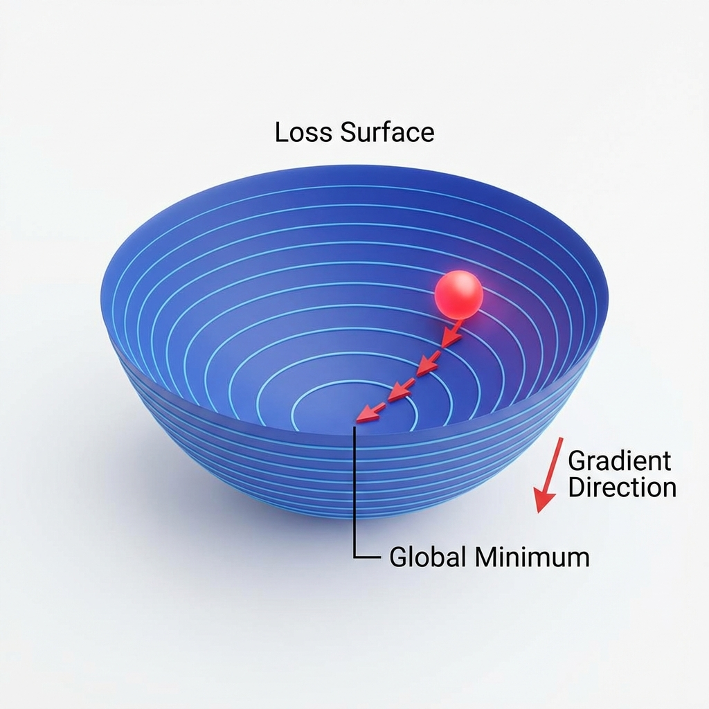
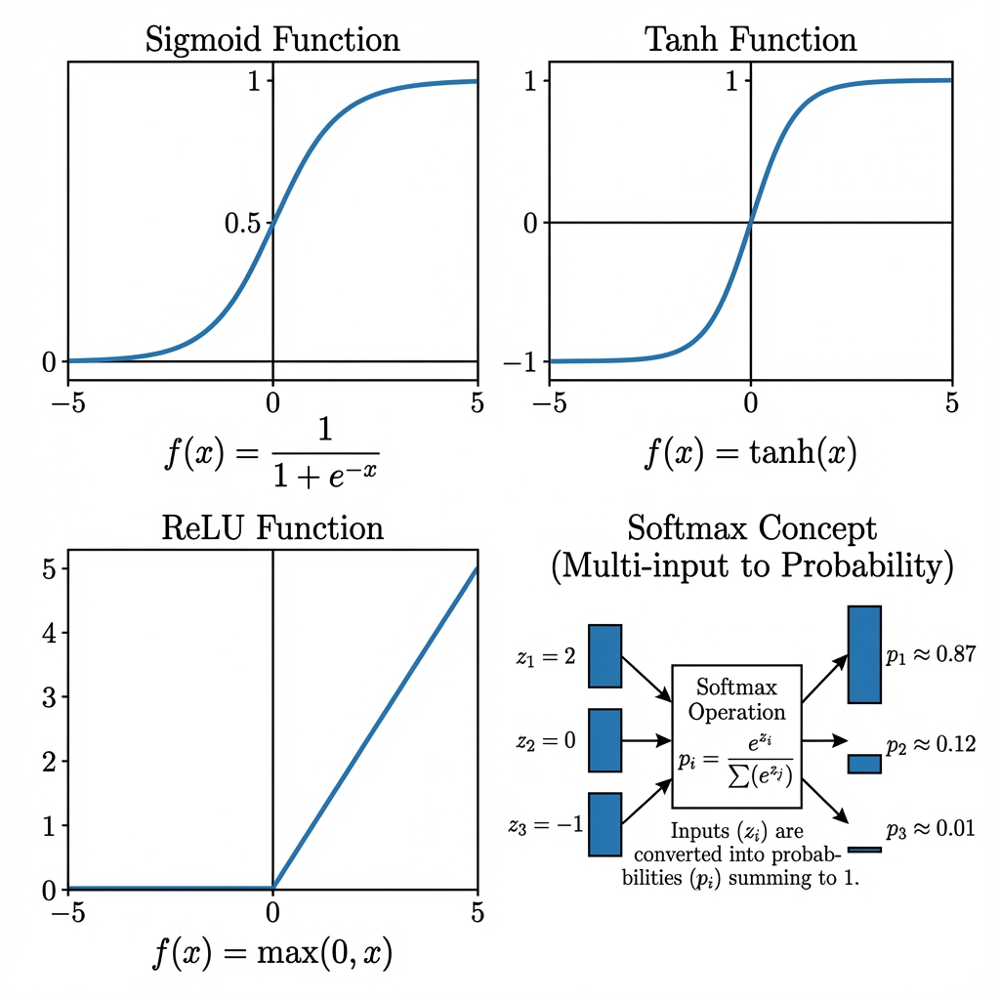
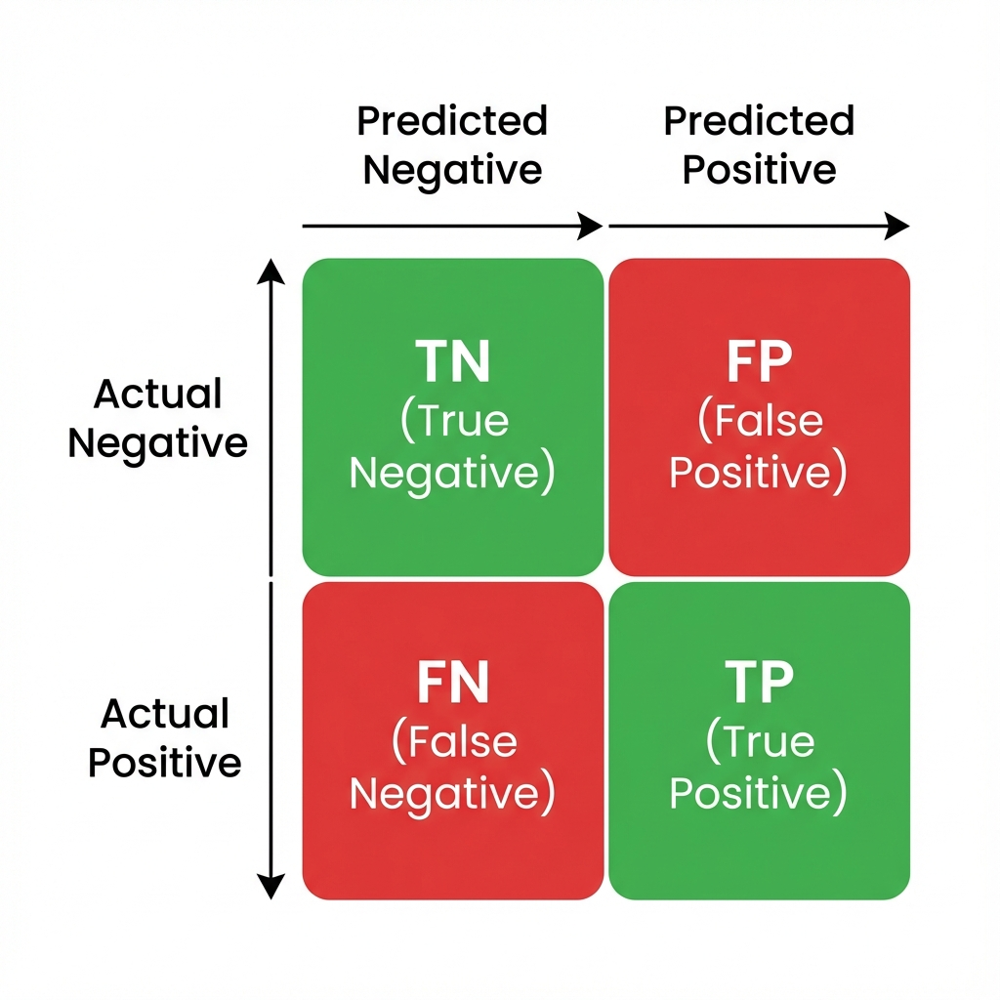
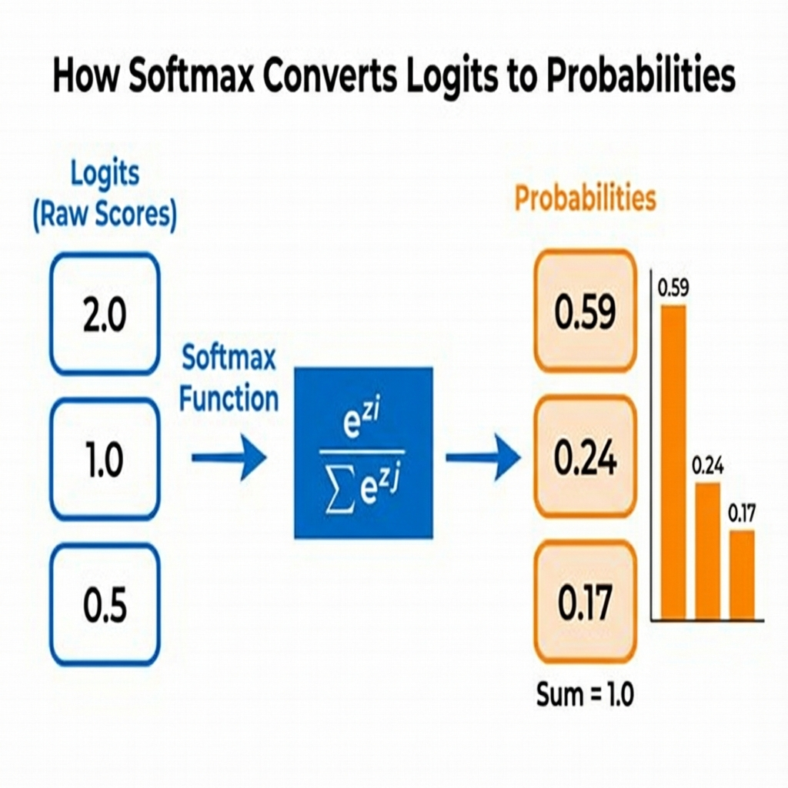
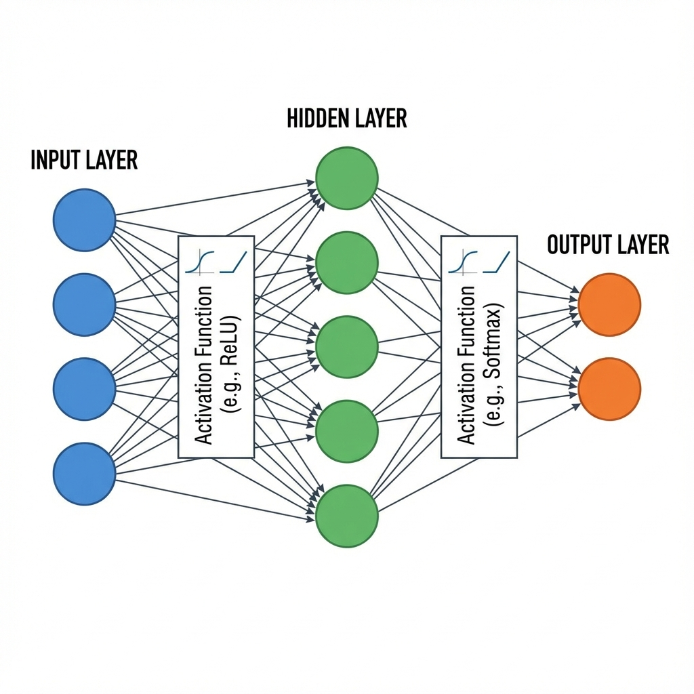
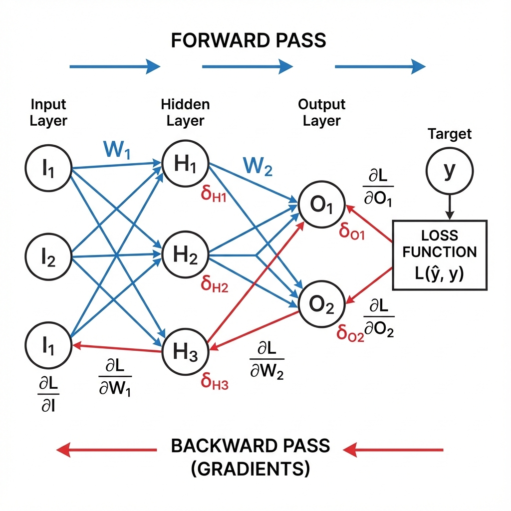
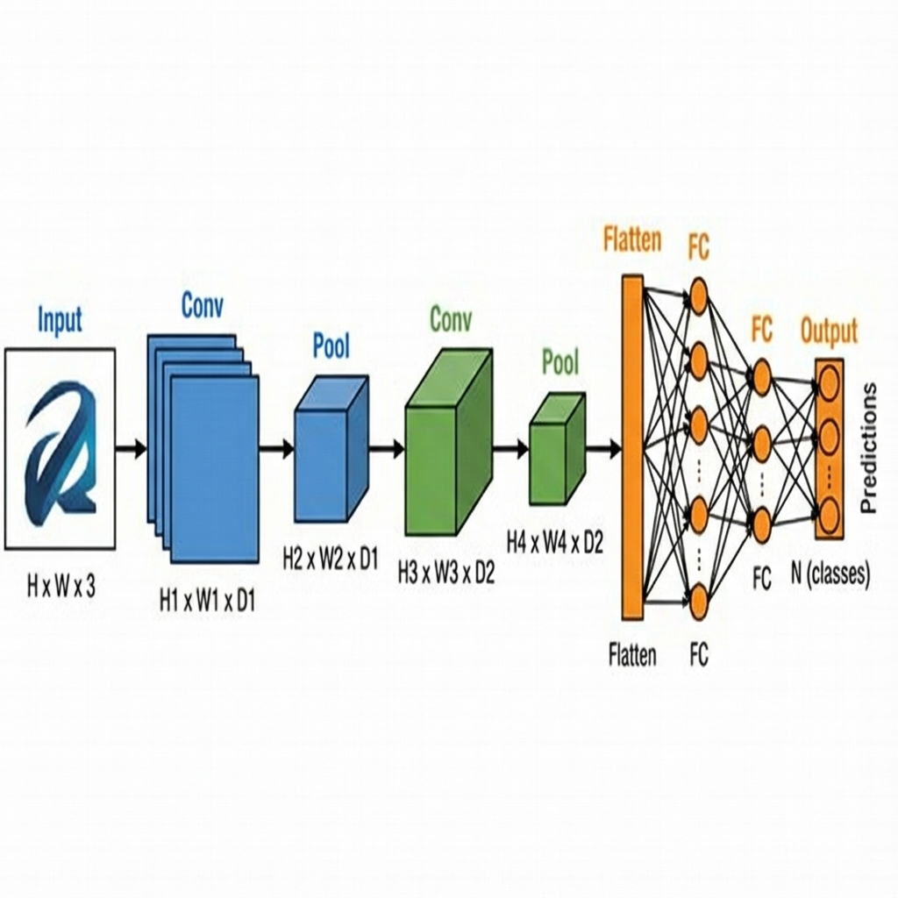
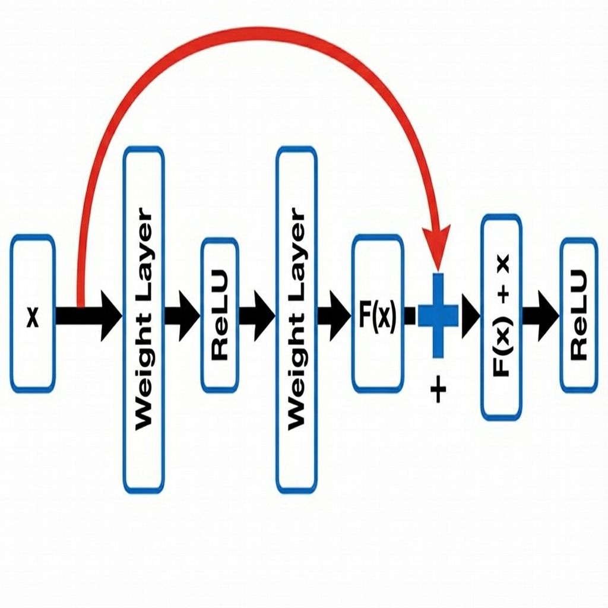

# 📚 Deep Neural Networks - Comprehensive Visual Study Guide

> **Complete Theory, Math, and Diagrams | AIMLCZG511 Midterm | Sessions 1-8**

---

# Table of Contents

1. [Q1: Perceptron](#q1-perceptron)
2. [Q2: Linear Regression & Gradient Descent](#q2-linear-regression--gradient-descent)
3. [Q3: Binary Classification (Logistic Regression)](#q3-binary-classification)
4. [Q4: Softmax & Multi-class Classification](#q4-softmax--multi-class-classification)
5. [Q5: Deep Feedforward Neural Networks](#q5-deep-feedforward-neural-networks)
6. [Bonus: CNN Architectures](#bonus-cnn-architectures)

---

# Q1: Perceptron

## 1.1 Architecture


The **perceptron** is the simplest neural network - a single artificial neuron that makes decisions by weighing up evidence.

### Components:
| Component | Symbol | Description |
|-----------|--------|-------------|
| **Inputs** | x₁, x₂, ..., xₙ | Feature values |
| **Weights** | w₁, w₂, ..., wₙ | Importance of each input |
| **Bias** | w₀ or b | Threshold for activation |
| **Summation** | Σ | Weighted sum of inputs |
| **Activation** | f(z) | Decision function (step/sign) |
| **Output** | ŷ | Prediction (+1 or -1) |

---

## 1.2 Mathematical Model

### Step 1: Compute Weighted Sum
$$z = w_0 \cdot 1 + w_1 \cdot x_1 + w_2 \cdot x_2 + \ldots + w_n \cdot x_n = \sum_{i=0}^{n} w_i x_i = \mathbf{w}^T \mathbf{x}$$

### Step 2: Apply Activation Function

**For Bipolar Output (+1, -1):**
$$\hat{y} = \text{sign}(z) = \begin{cases} +1 & \text{if } z \geq 0 \\ -1 & \text{if } z < 0 \end{cases}$$

**For Binary Output (0, 1):**
$$\hat{y} = \text{step}(z) = \begin{cases} 1 & \text{if } z \geq 0 \\ 0 & \text{if } z < 0 \end{cases}$$

---

## 1.3 Perceptron Learning Algorithm

### The Update Rule

When prediction is **wrong** (ŷ ≠ t):

$$\Delta w_i = \eta (t - \hat{y}) x_i$$
$$w_i^{\text{new}} = w_i^{\text{old}} + \Delta w_i$$

Where:
- **η** = learning rate (typically 0.1 to 1.0)
- **t** = target (expected output)
- **ŷ** = predicted output
- **xᵢ** = input value (x₀ = 1 for bias)

### Intuition

| Condition | t - ŷ | Action |
|-----------|-------|--------|
| Correct prediction | 0 | No update |
| Predicted -1, should be +1 | +2 | Increase weights |
| Predicted +1, should be -1 | -2 | Decrease weights |

---

## 1.4 Worked Example: NAND Gate (Bipolar)

**Truth Table:**
| x₁ | x₂ | NAND (t) |
|----|----|----------|
| -1 | -1 | +1 |
| -1 | +1 | +1 |
| +1 | -1 | +1 |
| +1 | +1 | -1 |

**Setup:** w₀ = w₁ = w₂ = 0, η = 1, x₀ = 1

### Epoch 1 Calculations:

**Input 1:** x = [1, -1, -1], t = +1
```
z = 0(1) + 0(-1) + 0(-1) = 0
ŷ = sign(0) = +1 ✓
t - ŷ = +1 - (+1) = 0 → No update
w = [0, 0, 0]
```

**Input 2:** x = [1, -1, +1], t = +1
```
z = 0(1) + 0(-1) + 0(+1) = 0
ŷ = sign(0) = +1 ✓
t - ŷ = +1 - (+1) = 0 → No update
w = [0, 0, 0]
```

**Input 3:** x = [1, +1, -1], t = +1
```
z = 0(1) + 0(+1) + 0(-1) = 0
ŷ = sign(0) = +1 ✓
t - ŷ = +1 - (+1) = 0 → No update
w = [0, 0, 0]
```

**Input 4:** x = [1, +1, +1], t = -1
```
z = 0(1) + 0(+1) + 0(+1) = 0
ŷ = sign(0) = +1 ✗
t - ŷ = -1 - (+1) = -2 → UPDATE!

Δw₀ = 1 × (-2) × 1 = -2
Δw₁ = 1 × (-2) × 1 = -2
Δw₂ = 1 × (-2) × 1 = -2

w = [0-2, 0-2, 0-2] = [-2, -2, -2]
```

**Final Weights After Epoch 1:** w = [-2, -2, -2]

---

## 1.5 Linear Separability & XOR Problem

### Linear Separability
Two classes are **linearly separable** if a single straight line (hyperplane) can separate them.

**Perceptron Convergence Theorem:** If data is linearly separable, perceptron will converge in finite steps.

### XOR Problem
| x₁ | x₂ | XOR |
|----|----|-----|
| 0 | 0 | 0 |
| 0 | 1 | 1 |
| 1 | 0 | 1 |
| 1 | 1 | 0 |

**XOR is NOT linearly separable!** No single line can separate the classes.

**Solution:** Multi-Layer Perceptron (MLP) with hidden layer.

---

## 1.6 Python Code Template

```python
import numpy as np

def perceptron_train(X, y, eta=1.0, epochs=100):
    # Add bias column (x₀ = 1)
    X_bias = np.c_[np.ones(X.shape[0]), X]
    
    # Initialize weights to zeros
    w = np.zeros(X_bias.shape[1])
    
    for epoch in range(epochs):
        for i in range(len(X)):
            # Compute weighted sum
            z = np.dot(w, X_bias[i])
            
            # Apply sign activation
            y_pred = 1 if z >= 0 else -1
            
            # Update if prediction is wrong
            if y_pred != y[i]:
                w = w + eta * (y[i] - y_pred) * X_bias[i]
    
    return w
```

---

# Q2: Linear Regression & Gradient Descent

## 2.1 Gradient Descent Visualization



Gradient descent finds the minimum of the loss function by iteratively stepping in the direction of steepest descent.

---

## 2.2 Linear Regression Model

### Single Neuron for Regression

The model predicts continuous values:
$$\hat{y} = w_0 + w_1 x_1 + w_2 x_2 + \ldots + w_d x_d = \mathbf{w}^T \mathbf{x}$$

### Matrix Formulation

**Design Matrix:**
$$\mathbf{X} = \begin{bmatrix} 1 & x_1^{(1)} & x_2^{(1)} & \ldots & x_d^{(1)} \\ 1 & x_1^{(2)} & x_2^{(2)} & \ldots & x_d^{(2)} \\ \vdots & \vdots & \vdots & \ddots & \vdots \\ 1 & x_1^{(N)} & x_2^{(N)} & \ldots & x_d^{(N)} \end{bmatrix}$$

**Vectorized Prediction:**
$$\hat{\mathbf{y}} = \mathbf{X} \mathbf{w}$$

---

## 2.3 Mean Squared Error (MSE) Loss

### Per-Example Loss
$$\ell^{(i)} = \frac{1}{2}(\hat{y}^{(i)} - y^{(i)})^2$$

### Total Loss (Cost Function)
$$J(\mathbf{w}) = \frac{1}{N} \sum_{i=1}^{N} \frac{1}{2}(\hat{y}^{(i)} - y^{(i)})^2 = \frac{1}{2N} \|\mathbf{X}\mathbf{w} - \mathbf{y}\|^2$$

### RMSE (Root Mean Squared Error)
$$\text{RMSE} = \sqrt{\text{MSE}} = \sqrt{\frac{1}{N} \sum_{i=1}^{N}(\hat{y}^{(i)} - y^{(i)})^2}$$

**RMSE is in the same units as the target variable** - more interpretable!

---

## 2.4 Gradient Derivation

### Chain Rule Application

$$\frac{\partial J}{\partial w_j} = \frac{\partial}{\partial w_j} \left[ \frac{1}{2N} \sum_{i=1}^{N} (\mathbf{w}^T\mathbf{x}^{(i)} - y^{(i)})^2 \right]$$

**Step-by-step:**
1. Let $e^{(i)} = \hat{y}^{(i)} - y^{(i)}$ (error)
2. $\frac{\partial}{\partial w_j}(e^{(i)})^2 = 2 e^{(i)} \cdot \frac{\partial e^{(i)}}{\partial w_j}$
3. $\frac{\partial e^{(i)}}{\partial w_j} = \frac{\partial}{\partial w_j}(\mathbf{w}^T\mathbf{x}^{(i)}) = x_j^{(i)}$
4. $\frac{\partial}{\partial w_j}(e^{(i)})^2 = 2 e^{(i)} \cdot x_j^{(i)}$

### Final Gradient Formula

**Per-example:**
$$\nabla_{\mathbf{w}} \ell^{(i)} = (\hat{y}^{(i)} - y^{(i)}) \mathbf{x}^{(i)}$$

**Batch (all examples):**
$$\nabla_{\mathbf{w}} J = \frac{1}{N} \sum_{i=1}^{N} (\hat{y}^{(i)} - y^{(i)}) \mathbf{x}^{(i)} = \frac{1}{N} \mathbf{X}^T (\mathbf{X}\mathbf{w} - \mathbf{y})$$

---

## 2.5 Gradient Descent Update Rule

$$\mathbf{w}^{(t+1)} = \mathbf{w}^{(t)} - \eta \nabla_{\mathbf{w}} J$$

$$\mathbf{w}^{(t+1)} = \mathbf{w}^{(t)} - \frac{\eta}{N} \mathbf{X}^T (\mathbf{X}\mathbf{w}^{(t)} - \mathbf{y})$$

---

## 2.6 Worked Example

**Data:**
| Size (x₁) | Price (y) |
|-----------|-----------|
| 1 | 2 |
| 2 | 4 |
| 3 | 5 |

**Setup:** w⁽⁰⁾ = [0, 0]ᵀ, η = 0.1, N = 3

### Step-by-Step Calculation

**Matrices:**
$$\mathbf{X} = \begin{bmatrix} 1 & 1 \\ 1 & 2 \\ 1 & 3 \end{bmatrix}, \quad \mathbf{y} = \begin{bmatrix} 2 \\ 4 \\ 5 \end{bmatrix}, \quad \mathbf{w}^{(0)} = \begin{bmatrix} 0 \\ 0 \end{bmatrix}$$

**Step 1: Compute Predictions**
$$\hat{\mathbf{y}}^{(0)} = \mathbf{X}\mathbf{w}^{(0)} = \begin{bmatrix} 1 & 1 \\ 1 & 2 \\ 1 & 3 \end{bmatrix} \begin{bmatrix} 0 \\ 0 \end{bmatrix} = \begin{bmatrix} 0 \\ 0 \\ 0 \end{bmatrix}$$

**Step 2: Compute Error**
$$\mathbf{e} = \hat{\mathbf{y}} - \mathbf{y} = \begin{bmatrix} 0-2 \\ 0-4 \\ 0-5 \end{bmatrix} = \begin{bmatrix} -2 \\ -4 \\ -5 \end{bmatrix}$$

**Step 3: Compute MSE Loss**
$$J = \frac{1}{2 \times 3}((-2)^2 + (-4)^2 + (-5)^2) = \frac{1}{6}(4 + 16 + 25) = \frac{45}{6} = 7.5$$

**Step 4: Compute Gradient**
$$\nabla J = \frac{1}{N} \mathbf{X}^T \mathbf{e} = \frac{1}{3} \begin{bmatrix} 1 & 1 & 1 \\ 1 & 2 & 3 \end{bmatrix} \begin{bmatrix} -2 \\ -4 \\ -5 \end{bmatrix}$$

$$= \frac{1}{3} \begin{bmatrix} -2-4-5 \\ -2-8-15 \end{bmatrix} = \frac{1}{3} \begin{bmatrix} -11 \\ -25 \end{bmatrix} = \begin{bmatrix} -3.67 \\ -8.33 \end{bmatrix}$$

**Step 5: Update Weights**
$$\mathbf{w}^{(1)} = \mathbf{w}^{(0)} - \eta \nabla J = \begin{bmatrix} 0 \\ 0 \end{bmatrix} - 0.1 \begin{bmatrix} -3.67 \\ -8.33 \end{bmatrix} = \begin{bmatrix} 0.367 \\ 0.833 \end{bmatrix}$$

---

## 2.7 Python Code Template

```python
import numpy as np

def batch_gradient_descent(X, y, eta=0.01, epochs=1000):
    # Add bias column
    X_b = np.c_[np.ones(X.shape[0]), X]
    N = len(y)
    
    # Initialize weights
    w = np.zeros(X_b.shape[1])
    
    for epoch in range(epochs):
        # Predictions
        y_pred = X_b @ w
        
        # Error
        error = y_pred - y
        
        # Gradient
        gradient = (1/N) * X_b.T @ error
        
        # Update
        w = w - eta * gradient
    
    return w
```

---

# Q3: Binary Classification

## 3.1 Activation Functions



---

## 3.2 Sigmoid Function

### Definition
$$\sigma(z) = \frac{1}{1 + e^{-z}}$$

### Properties
| Property | Value |
|----------|-------|
| Output Range | (0, 1) |
| σ(0) | 0.5 |
| σ(∞) | 1 |
| σ(-∞) | 0 |
| σ(-z) | 1 - σ(z) |

### Derivative (Important for Backprop!)

$$\sigma'(z) = \sigma(z) \cdot (1 - \sigma(z))$$

**Proof:**
$$\sigma(z) = (1 + e^{-z})^{-1}$$
$$\sigma'(z) = -1 \cdot (1 + e^{-z})^{-2} \cdot (-e^{-z}) = \frac{e^{-z}}{(1+e^{-z})^2}$$
$$= \frac{1}{1+e^{-z}} \cdot \frac{e^{-z}}{1+e^{-z}} = \sigma(z) \cdot (1 - \sigma(z))$$

---

## 3.3 Binary Cross-Entropy Loss

### Per-Example Loss
$$\ell = -\left[ y \log(\hat{y}) + (1-y) \log(1-\hat{y}) \right]$$

### Interpretation
- If **y = 1**: Loss = -log(ŷ) → Penalizes if ŷ is low
- If **y = 0**: Loss = -log(1-ŷ) → Penalizes if ŷ is high

### Total Loss
$$J(\mathbf{w}) = -\frac{1}{N} \sum_{i=1}^{N} \left[ y^{(i)} \log(\hat{y}^{(i)}) + (1-y^{(i)}) \log(1-\hat{y}^{(i)}) \right]$$

---

## 3.4 Gradient Derivation (BCE + Sigmoid)

The gradient has a beautiful, simple form:

$$\frac{\partial \ell}{\partial w_j} = (\hat{y} - y) \cdot x_j$$

**Derivation:**
Using chain rule: $\frac{\partial \ell}{\partial w_j} = \frac{\partial \ell}{\partial \hat{y}} \cdot \frac{\partial \hat{y}}{\partial z} \cdot \frac{\partial z}{\partial w_j}$

The sigmoid derivative $\hat{y}(1-\hat{y})$ cancels with terms from BCE derivative, leaving:

$$\nabla_{\mathbf{w}} \ell = (\hat{y} - y) \mathbf{x}$$

**Same elegant form as linear regression!**

---

## 3.5 Confusion Matrix & Metrics



### Metrics Formulas

**Accuracy:**
$$\text{Accuracy} = \frac{TP + TN}{TP + TN + FP + FN}$$

**Precision:** (Of predicted positive, how many are correct?)
$$\text{Precision} = \frac{TP}{TP + FP}$$

**Recall/Sensitivity:** (Of actual positive, how many did we catch?)
$$\text{Recall} = \frac{TP}{TP + FN}$$

**F1 Score:** (Harmonic mean of precision and recall)
$$F_1 = 2 \times \frac{\text{Precision} \times \text{Recall}}{\text{Precision} + \text{Recall}}$$

---

## 3.6 When to Use Precision vs Recall

| Use Case | Priority | Reason |
|----------|----------|--------|
| **Spam Detection** | Precision | Don't mark good emails as spam |
| **Disease Screening** | Recall | Don't miss sick patients |
| **Fraud Detection** | Recall | Don't miss fraudulent transactions |
| **Search Results** | Precision | Show relevant results |

---

## 3.7 Worked Example

**Given:** x = [1, 2, 3] (with bias), w = [0.5, -0.2, 0.3], y = 1, η = 0.5

**Step 1: Compute z**
$$z = w^Tx = 0.5(1) + (-0.2)(2) + 0.3(3) = 0.5 - 0.4 + 0.9 = 1.0$$

**Step 2: Compute ŷ**
$$\hat{y} = \sigma(1.0) = \frac{1}{1 + e^{-1}} = \frac{1}{1 + 0.368} = \frac{1}{1.368} = 0.731$$

**Step 3: Compute Gradient**
$$\nabla \ell = (\hat{y} - y) \mathbf{x} = (0.731 - 1) \begin{bmatrix} 1 \\ 2 \\ 3 \end{bmatrix} = \begin{bmatrix} -0.269 \\ -0.538 \\ -0.807 \end{bmatrix}$$

**Step 4: Update Weights**
$$\mathbf{w}^{\text{new}} = \mathbf{w} - \eta \nabla\ell = \begin{bmatrix} 0.5 \\ -0.2 \\ 0.3 \end{bmatrix} - 0.5 \begin{bmatrix} -0.269 \\ -0.538 \\ -0.807 \end{bmatrix} = \begin{bmatrix} 0.635 \\ 0.069 \\ 0.704 \end{bmatrix}$$

---

## 3.8 Python Code Template

```python
import numpy as np

def sigmoid(z):
    return 1 / (1 + np.exp(-z))

def logistic_regression_sgd(X, y, eta=0.1, epochs=100):
    X_b = np.c_[np.ones(X.shape[0]), X]
    w = np.zeros(X_b.shape[1])
    
    for epoch in range(epochs):
        for i in range(len(X)):
            z = np.dot(w, X_b[i])
            y_pred = sigmoid(z)
            gradient = (y_pred - y[i]) * X_b[i]
            w = w - eta * gradient
    
    return w
```

---

# Q4: Softmax & Multi-class Classification

## 4.1 Softmax Visualization



---

## 4.2 Softmax Function

### Definition
For K classes with logits z = [z₁, z₂, ..., zₖ]:

$$\hat{y}_k = \text{softmax}(z_k) = \frac{e^{z_k}}{\sum_{j=1}^{K} e^{z_j}}$$

### Properties
1. All outputs are in (0, 1): $0 < \hat{y}_k < 1$
2. Outputs sum to 1: $\sum_{k=1}^{K} \hat{y}_k = 1$
3. Interpretable as probabilities

---

## 4.3 Categorical Cross-Entropy Loss

For one-hot encoded target y:

$$\ell = -\sum_{k=1}^{K} y_k \log(\hat{y}_k)$$

Since only one $y_c = 1$ (for true class c):
$$\ell = -\log(\hat{y}_c)$$

---

## 4.4 Gradient (Softmax + CCE)

The gradient has the same elegant form:

$$\frac{\partial \ell}{\partial z_k} = \hat{y}_k - y_k$$

**In vector form:**
$$\nabla_{\mathbf{z}} \ell = \hat{\mathbf{y}} - \mathbf{y}$$

---

## 4.5 Worked Example

**Given:** z = [2.5, 0.3, -1.2, 3.1, 0.7] for 5 classes, true class = 3 (bird)

**Step 1: Compute Exponentials**
| Class | z | e^z |
|-------|---|-----|
| 0 | 2.5 | 12.18 |
| 1 | 0.3 | 1.35 |
| 2 | -1.2 | 0.30 |
| 3 | 3.1 | 22.20 |
| 4 | 0.7 | 2.01 |

**Step 2: Compute Sum**
$$\sum e^{z_j} = 12.18 + 1.35 + 0.30 + 22.20 + 2.01 = 38.04$$

**Step 3: Compute Softmax Probabilities**
$$\hat{y} = \left[\frac{12.18}{38.04}, \frac{1.35}{38.04}, \frac{0.30}{38.04}, \frac{22.20}{38.04}, \frac{2.01}{38.04}\right]$$
$$\hat{y} = [0.32, 0.04, 0.01, 0.58, 0.05]$$

**Step 4: Compute Cross-Entropy Loss**
True class = 3, so $y_3 = 1$:
$$\ell = -\log(\hat{y}_3) = -\log(0.58) = 0.54$$

**Step 5: Check Prediction**
$$\text{Predicted class} = \arg\max(\hat{y}) = 3$$
Matches true class → **Correct!** ✓

---

## 4.6 Python Code Template

```python
import numpy as np

def softmax(z):
    # Subtract max for numerical stability
    exp_z = np.exp(z - np.max(z))
    return exp_z / np.sum(exp_z)

def categorical_cross_entropy(y_pred, y_true):
    # y_true is one-hot encoded
    eps = 1e-15
    y_pred = np.clip(y_pred, eps, 1-eps)
    return -np.sum(y_true * np.log(y_pred))

# Example
z = np.array([2.5, 0.3, -1.2, 3.1, 0.7])
y_pred = softmax(z)
print("Probabilities:", y_pred)
print("Sum:", np.sum(y_pred))  # Should be 1.0
```

---

# Q5: Deep Feedforward Neural Networks

## 5.1 Network Architecture



---

## 5.2 Forward & Backward Propagation



---

## 5.3 Notation

| Symbol | Meaning |
|--------|---------|
| L | Number of layers (excluding input) |
| $n_\ell$ | Number of neurons in layer ℓ |
| $\mathbf{W}^{(\ell)}$ | Weight matrix for layer ℓ, shape: $(n_{\ell-1} \times n_\ell)$ |
| $\mathbf{b}^{(\ell)}$ | Bias vector for layer ℓ, shape: $(n_\ell,)$ |
| $\mathbf{z}^{(\ell)}$ | Pre-activation (linear output) |
| $\mathbf{h}^{(\ell)}$ | Activation (non-linear output) |
| $\sigma^{(\ell)}$ | Activation function for layer ℓ |

---

## 5.4 Forward Propagation Equations

**Initialize:**
$$\mathbf{h}^{(0)} = \mathbf{x}$$

**For each layer ℓ = 1, 2, ..., L:**

**Step 1: Linear Transformation**
$$\mathbf{z}^{(\ell)} = \mathbf{h}^{(\ell-1)} \mathbf{W}^{(\ell)} + \mathbf{b}^{(\ell)}$$

**Step 2: Non-linear Activation**
$$\mathbf{h}^{(\ell)} = \sigma^{(\ell)}(\mathbf{z}^{(\ell)})$$

**Final Output:**
$$\hat{\mathbf{y}} = \mathbf{h}^{(L)}$$

---

## 5.5 ReLU Activation

### Definition
$$\text{ReLU}(z) = \max(0, z)$$

### Derivative
$$\text{ReLU}'(z) = \begin{cases} 1 & \text{if } z > 0 \\ 0 & \text{if } z \leq 0 \end{cases}$$

### Advantages
- No vanishing gradient for positive inputs
- Computationally efficient
- Sparse activation

---

## 5.6 Backpropagation Equations

**Error Signal Definition:**
$$\boldsymbol{\delta}^{(\ell)} = \frac{\partial J}{\partial \mathbf{z}^{(\ell)}}$$

**Output Layer (for BCE/CCE with Sigmoid/Softmax):**
$$\boldsymbol{\delta}^{(L)} = \hat{\mathbf{y}} - \mathbf{y}$$

**Hidden Layers (chain rule):**
$$\boldsymbol{\delta}^{(\ell)} = \left(\boldsymbol{\delta}^{(\ell+1)} \mathbf{W}^{(\ell+1)T}\right) \odot \sigma'^{(\ell)}(\mathbf{z}^{(\ell)})$$

**Parameter Gradients:**
$$\frac{\partial J}{\partial \mathbf{W}^{(\ell)}} = \mathbf{h}^{(\ell-1)T} \boldsymbol{\delta}^{(\ell)}$$
$$\frac{\partial J}{\partial \mathbf{b}^{(\ell)}} = \sum \boldsymbol{\delta}^{(\ell)}$$

---

## 5.7 Worked Example: Forward Pass

**Network:** 2 inputs → 3 hidden (ReLU) → 2 outputs (Sigmoid)

**Given:**
- x = [1.0, 0.5]ᵀ
- W⁽¹⁾ = [[0.5, 0.2, -0.3], [0.8, 0.1, -0.4]]
- b⁽¹⁾ = [0.1, -0.2, 0.3]
- W⁽²⁾ = [[0.4, -0.1], [0.6, 0.2], [0.7, -0.3]]
- b⁽²⁾ = [0.2, -0.1]

**Layer 1 Calculation:**

$$\mathbf{z}^{(1)} = \mathbf{x}^T \mathbf{W}^{(1)} + \mathbf{b}^{(1)}$$

$$= [1.0, 0.5] \begin{bmatrix} 0.5 & 0.2 & -0.3 \\ 0.8 & 0.1 & -0.4 \end{bmatrix} + [0.1, -0.2, 0.3]$$

$$= [0.5+0.4, 0.2+0.05, -0.3-0.2] + [0.1, -0.2, 0.3]$$

$$= [0.9, 0.25, -0.5] + [0.1, -0.2, 0.3] = [1.0, 0.05, -0.2]$$

$$\mathbf{h}^{(1)} = \text{ReLU}(\mathbf{z}^{(1)}) = [\max(0, 1.0), \max(0, 0.05), \max(0, -0.2)]$$
$$= [1.0, 0.05, 0.0]$$

**Layer 2 Calculation:**

$$\mathbf{z}^{(2)} = \mathbf{h}^{(1)} \mathbf{W}^{(2)} + \mathbf{b}^{(2)}$$

$$= [1.0, 0.05, 0.0] \begin{bmatrix} 0.4 & -0.1 \\ 0.6 & 0.2 \\ 0.7 & -0.3 \end{bmatrix} + [0.2, -0.1]$$

$$= [0.4+0.03+0, -0.1+0.01+0] + [0.2, -0.1]$$

$$= [0.43, -0.09] + [0.2, -0.1] = [0.63, -0.19]$$

$$\hat{\mathbf{y}} = \sigma(\mathbf{z}^{(2)}) = [\sigma(0.63), \sigma(-0.19)]$$
$$= [0.65, 0.45]$$

---

## 5.8 Parameter Counting

### Formula (Without Bias)
$$\text{Total Weights} = \sum_{\ell=1}^{L} n_{\ell-1} \times n_\ell$$

### Formula (With Bias)
$$\text{Total Parameters} = \sum_{\ell=1}^{L} n_\ell (n_{\ell-1} + 1)$$

### Example: 8 → 10 → 6 → 4 (No Bias)
| Layer | Calculation | Weights |
|-------|-------------|---------|
| 1 | 8 × 10 | 80 |
| 2 | 10 × 6 | 60 |
| 3 | 6 × 4 | 24 |
| **Total** | | **164** |

---

## 5.9 Python Code Template

```python
import numpy as np

def relu(z):
    return np.maximum(0, z)

def sigmoid(z):
    return 1 / (1 + np.exp(-z))

def forward_pass(X, W1, b1, W2, b2):
    # Layer 1
    z1 = X @ W1 + b1
    h1 = relu(z1)
    
    # Layer 2 (output)
    z2 = h1 @ W2 + b2
    y_pred = sigmoid(z2)
    
    return y_pred, z1, h1, z2

def count_params(layer_sizes, include_bias=True):
    total = 0
    for i in range(len(layer_sizes) - 1):
        weights = layer_sizes[i] * layer_sizes[i+1]
        bias = layer_sizes[i+1] if include_bias else 0
        total += weights + bias
    return total

# Example
layers = [8, 10, 6, 4]
print(f"Total params (no bias): {count_params(layers, False)}")  # 164
print(f"Total params (with bias): {count_params(layers, True)}")  # 184
```

---

# Bonus: CNN Architectures

## CNN Architecture



---

## ResNet Skip Connections



---

## CNN Output Size Formula

$$\text{output size} = \left\lfloor \frac{n + 2p - f}{s} \right\rfloor + 1$$

Where:
- **n** = input size
- **p** = padding
- **f** = filter/kernel size
- **s** = stride

---

## Key CNN Architectures

| Architecture | Key Innovation | Year |
|--------------|----------------|------|
| **LeNet** | First successful CNN | 1998 |
| **AlexNet** | ReLU, Dropout, GPU | 2012 |
| **VGG** | Small 3×3 filters, deeper | 2014 |
| **ResNet** | Skip connections | 2015 |

---

## Transfer Learning

**Feature Extraction:** Freeze pre-trained layers, train only new head
**Fine-tuning:** Unfreeze some layers, train with small learning rate

---

# 📋 Quick Reference Summary

## All Gradients Have Same Form!

| Model | Loss | Activation | Gradient |
|-------|------|------------|----------|
| Linear Regression | MSE | Identity | **ŷ - y** |
| Logistic Regression | BCE | Sigmoid | **ŷ - y** |
| Softmax Classification | CCE | Softmax | **ŷ - y** |

## Key Formulas to Memorize

```
Perceptron:     Δw = η(t - ŷ)x
Gradient:       ∇J = (1/N)Xᵀ(Xw - y)
Sigmoid:        σ(z) = 1/(1+e⁻ᶻ)
Sigmoid':       σ(z)(1-σ(z))
Softmax:        ŷₖ = eᶻᵏ/Σeᶻʲ
ReLU:           max(0, z)
Backprop:       δ⁽ℓ⁾ = (δ⁽ℓ⁺¹⁾Wᵀ) ⊙ σ'
CNN Size:       ⌊(n+2p-f)/s⌋ + 1
Params:         Σ(nₗ × nₗ₋₁)
```

---

**Best of luck with your exam! 🍀**
